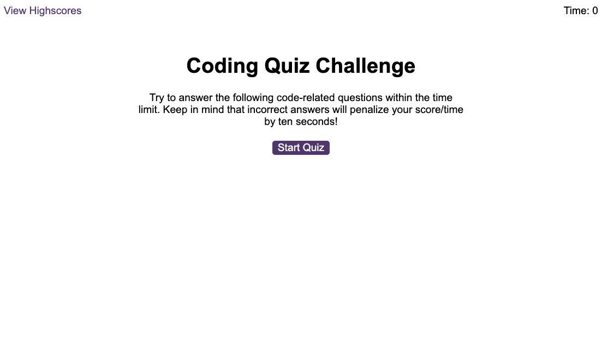
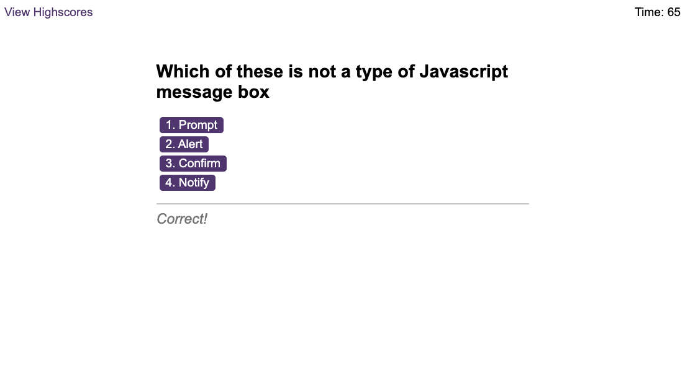
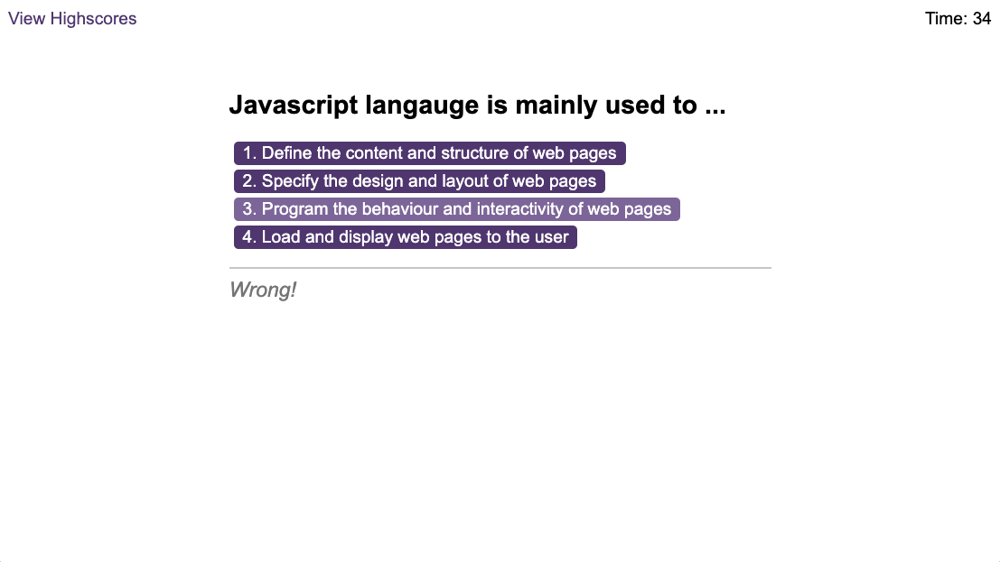
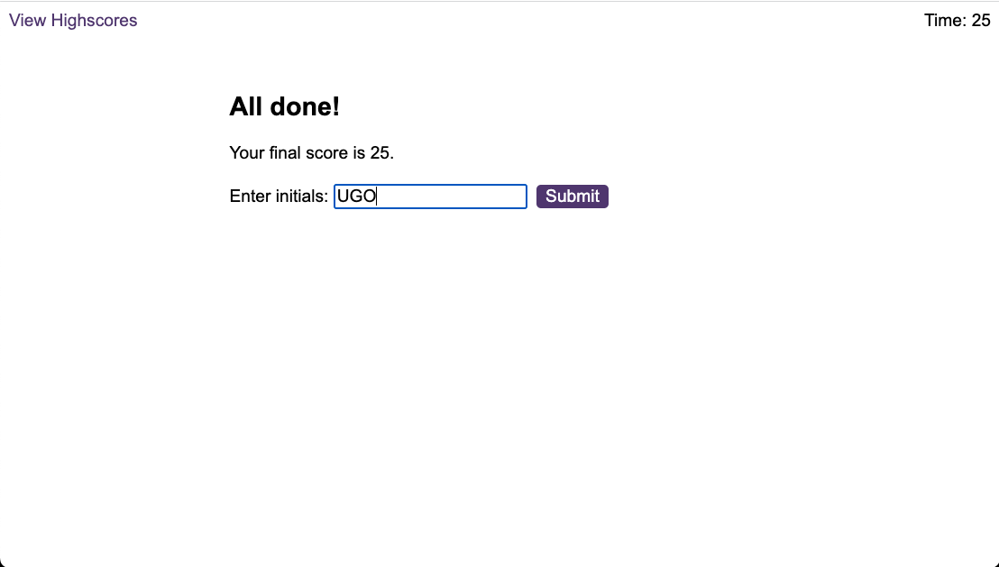
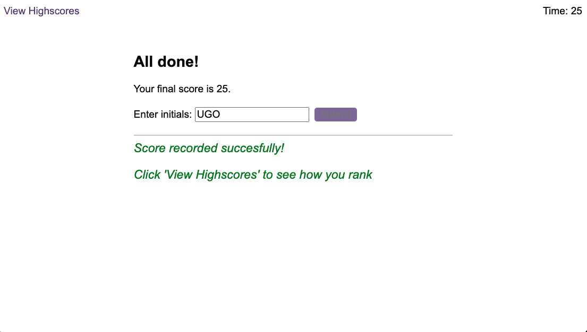
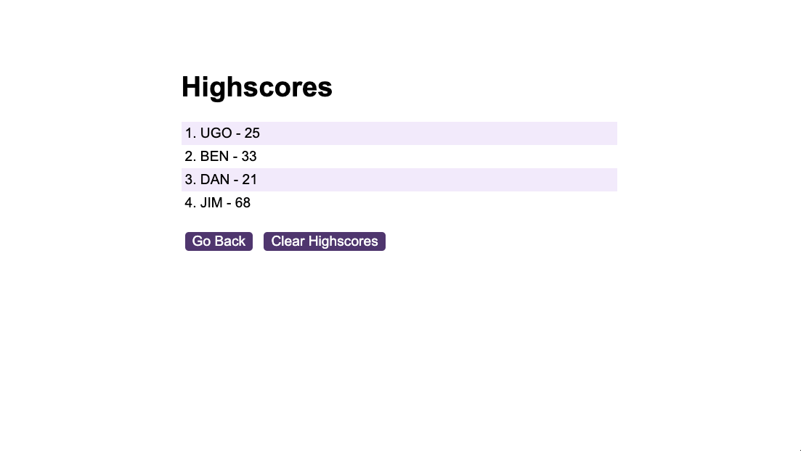
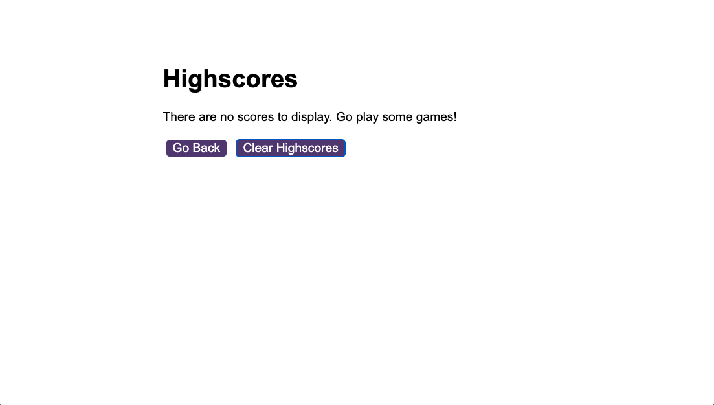

# Quizztastic-Coding-Quiz

## A multiple-choice coding quiz that tracks highscores and quiz-takers' initials

------------------------------------------------------------
## Table of Contents

- [Overview](#overview)
- [Screenshots](#screenshots)
- [Usage](#usage)
- [Built With](#built-with)
- [Contact](#contact)
- [Acknowledgements](#acknowledgements)
- [License](#license)

## Overview

This is a simple quiz that tests your knowledge of Javascript with 5 multiple choice questions. The goal is to try and answer all questions correctly in as little time as possible. Getting the answer wrong deducts 10 seconds off the clock, which is also 10 points of your final score. It's exhiliarating!

😈 Click [here](https://ugopreneur.github.io/Quizztastic-Coding-Quiz/) to play.

**Motivation:** The goal was to show a real-world application of my newly learned Javascript skills (Iterating over arrays, writing For loops, working with different variable scopes, nested loops and nested functions, complex if/else statements, object methods, DOM element manipulation, writing and reading to/from local storage, using setInterval to run a timer and much more).

All game logic written completely in javascript!

## Screenshots

#### Start Game screen

  

#### Question screen with 'Correct!' notification at bottom after playere selects the right answer

  

#### Question screen with 'Wrong!' notification at bottom after playere selects the wrong answer

  

#### Game Over screen displaying players score and requesting their initials

  

#### Game Over screen after players initials are submitted

  

#### Highscores screen showing all players initials and scores

  

#### Highscores screen after player clicks 'clear highscores' button

  

## Usage

1. Click [here](https://ugopreneur.github.io/Quizztastic-Coding-Quiz/) to open game in your browser.
2. Click the red 'Start Quiz' button.
3. Try and answer all questions correctly in as little time as possible.
4. Enter your initials and click 'submit' once the game is over.
5. Click 'View highscores' to see the scoreboard.

## Built With

- Basic HTML to load the web page
- CSS for styling
- Intermediate-level Javascript for all logic: Arrays, Variables, methods, For Loops, nested for loops, Functions, nested functions, prompts, if/else statements, Manipulating HTML DOM, local storage etc.
- .wav audio files for sound notifications

See acknowledgments at bottom of page or click [here](#acknowledgements) 

## Contact

- Email: ugnwokoro@yahoo.com
- Twitter: https://twitter.com/ugopreneur
- LinkedIn: https://www.linkedin.com/in/ugonwokoro/ 
- Dev.to: https://dev.to/ugopreneur 

## Acknowledgements

A few sources i must give credit for helping me build this:

- The usual tips and resources from W3Schools, Mozilla.org and Stack Overflow
- My good friend Gbenga Oyeniyi
- chatGPT for guidance when i was lost
- Youtube video: [Build A Quiz App With JavaScript](https://www.youtube.com/watch?v=riDzcEQbX6k)

-----------------------------------------------------
## License
MIT License

Copyright (c) 2023 Ugo Nwokoro

Permission is hereby granted, free of charge, to any person obtaining a copy
of this software and associated documentation files (the "Software"), to deal
in the Software without restriction, including without limitation the rights
to use, copy, modify, merge, publish, distribute, sublicense, and/or sell
copies of the Software, and to permit persons to whom the Software is
furnished to do so, subject to the following conditions:

The above copyright notice and this permission notice shall be included in all
copies or substantial portions of the Software.

THE SOFTWARE IS PROVIDED "AS IS", WITHOUT WARRANTY OF ANY KIND, EXPRESS OR
IMPLIED, INCLUDING BUT NOT LIMITED TO THE WARRANTIES OF MERCHANTABILITY,
FITNESS FOR A PARTICULAR PURPOSE AND NONINFRINGEMENT. IN NO EVENT SHALL THE
AUTHORS OR COPYRIGHT HOLDERS BE LIABLE FOR ANY CLAIM, DAMAGES OR OTHER
LIABILITY, WHETHER IN AN ACTION OF CONTRACT, TORT OR OTHERWISE, ARISING FROM,
OUT OF OR IN CONNECTION WITH THE SOFTWARE OR THE USE OR OTHER DEALINGS IN THE
SOFTWARE.